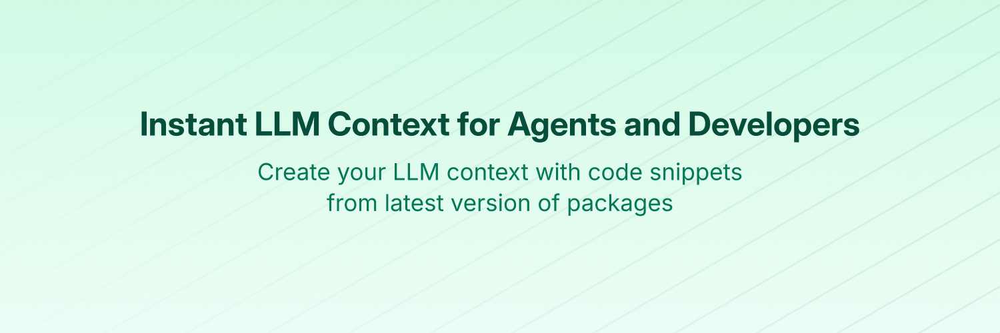

# Security Policy

# dependabot

## Supported Versions



# Context7 MCP - Up-to-date Code Docs For Any Prompt

[](https://context7.com) [](https://smithery.ai/server/@upstash/context7-mcp) [](https://www.npmjs.com/package/@upstash/context7-mcp) [](./LICENSE)

[](https://cursor.com/en/install-mcp?name=context7&config=eyJ1cmwiOiJodHRwczovL21jcC5jb250ZXh0Ny5jb20vbWNwIn0%3D) [](https://insiders.vscode.dev/redirect?url=vscode%3Amcp%2Finstall%3F%7B%22name%22%3A%22context7%22%2C%22command%22%3A%22npx%22%2C%22args%22%3A%5B%22-y%22%2C%22%40upstash%2Fcontext7-mcp%40latest%22%5D%7D)

[](./docs/README.zh-TW.md) [](./docs/README.zh-CN.md) [](./docs/README.ja.md) [](./docs/README.ko.md) [](./docs/README.es.md) [](./docs/README.fr.md) [-purple>)](./docs/README.pt-BR.md) [](./docs/README.it.md) [](./docs/README.id-ID.md) [](./docs/README.de.md) [](./docs/README.ru.md) [](./docs/README.uk.md) [](./docs/README.tr.md) [](./docs/README.ar.md) [](./docs/README.vi.md)

## ❌ Without Context7

LLMs rely on outdated or generic information about the libraries you use. You get:

- ❌ Code examples are outdated and based on year-old training data
- ❌ Hallucinated APIs that don't even exist
- ❌ Generic answers for old package versions

## ✅ With Context7

Context7 MCP pulls up-to-date, version-specific documentation and code examples straight from the source — and places them directly into your prompt.

Add `use context7` to your prompt in Cursor:

```txt
Create a Next.js middleware that checks for a valid JWT in cookies and redirects unauthenticated users to `/login`. use context7
```

```txt
Configure a Cloudflare Worker script to cache JSON API responses for five minutes. use context7
```

Context7 fetches up-to-date code examples and documentation right into your LLM's context.

- 1️⃣ Write your prompt naturally
- 2️⃣ Tell the LLM to `use context7`
- 3️⃣ Get working code answers

No tab-switching, no hallucinated APIs that don't exist, no outdated code generation.

## 📚 Adding Projects

Check out our [project addition guide](./docs/adding-projects.md) to learn how to add (or update) your favorite libraries to Context7.

## 🛠️ Installation

### Requirements

- Node.js >= v18.0.0
- Cursor, Claude Code, VSCode, Windsurf or another MCP Client
- Context7 API Key (Optional) for higher rate limits and private repositories (Get yours by creating an account at [context7.com/dashboard](https://context7.com/dashboard))

> [!WARNING]
> **SSE Protocol Deprecation Notice**
>
> The Server-Sent Events (SSE) transport protocol is deprecated and its endpoint will be removed in upcoming releases. Please use HTTP or stdio transport methods instead.

<details>
<summary><b>Installing via Smithery</b></summary>

To install Context7 MCP Server for any client automatically via [Smithery](https://smithery.ai/server/@upstash/context7-mcp):

```bash
npx -y @smithery/cli@latest install @upstash/context7-mcp --client <CLIENT_NAME> --key <YOUR_SMITHERY_KEY>
```

You can find your Smithery key in the [Smithery.ai webpage](https://smithery.ai/server/@upstash/context7-mcp).

</details>

<details>
<summary><b>Install in Cursor</b></summary>

Go to: `Settings` -> `Cursor Settings` -> `MCP` -> `Add new global MCP server`

Pasting the following configuration into your Cursor `~/.cursor/mcp.json` file is the recommended approach. You may also install in a specific project by creating `.cursor/mcp.json` in your project folder. See [Cursor MCP docs](https://docs.cursor.com/context/model-context-protocol) for more info.

> Since Cursor 1.0, you can click the install button below for instant one-click installation.

#### Cursor Remote Server Connection

[](https://cursor.com/en/install-mcp?name=context7&config=eyJ1cmwiOiJodHRwczovL21jcC5jb250ZXh0Ny5jb20vbWNwIn0%3D)

```json
{
  "mcpServers": {
    "context7": {
      "url": "https://mcp.context7.com/mcp",
      "headers": {
        "CONTEXT7_API_KEY": "YOUR_API_KEY"
      }
    }
  }
}
```

#### Cursor Local Server Connection

[](https://cursor.com/en/install-mcp?name=context7&config=eyJjb21tYW5kIjoibnB4IC15IEB1cHN0YXNoL2NvbnRleHQ3LW1jcCJ9)

```json
{
  "mcpServers": {
    "context7": {
      "command": "npx",
      "args": ["-y", "@upstash/context7-mcp", "--api-key", "YOUR_API_KEY"]
    }
  }
}
```

</details>

<details>
<summary><b>Install in Claude Code</b></summary>

Run this command. See [Claude Code MCP docs](https://docs.anthropic.com/en/docs/claude-code/mcp) for more info.

#### Claude Code Remote Server Connection

```sh
claude mcp add --transport http context7 https://mcp.context7.com/mcp --header "CONTEXT7_API_KEY: YOUR_API_KEY"
```

#### Claude Code Local Server Connection

```sh
claude mcp add context7 -- npx -y @upstash/context7-mcp --api-key YOUR_API_KEY
```

</details>

<details>
<summary><b>Install in Amp</b></summary>

Run this command in your terminal. See [Amp MCP docs](https://ampcode.com/manual#mcp) for more info.

#### Without API Key (Basic Usage)

```sh
amp mcp add context7 https://mcp.context7.com/mcp
```

#### With API Key (Higher Rate Limits & Private Repos)

```sh
amp mcp add context7 --header "CONTEXT7_API_KEY=YOUR_API_KEY" https://mcp.context7.com/mcp
```

</details>

<details>
<summary><b>Install in Windsurf</b></summary>

Add this to your Windsurf MCP config file. See [Windsurf MCP docs](https://docs.windsurf.com/windsurf/cascade/mcp) for more info.

#### Windsurf Remote Server Connection

```json
{
  "mcpServers": {
    "context7": {
      "serverUrl": "https://mcp.context7.com/mcp",
      "headers": {
        "CONTEXT7_API_KEY": "YOUR_API_KEY"
      }
    }
  }
}
```

#### Windsurf Local Server Connection

```json
{
  "mcpServers": {
    "context7": {
      "command": "npx",
      "args": ["-y", "@upstash/context7-mcp", "--api-key", "YOUR_API_KEY"]
    }
  }
}
```

</details>

<details>
<summary><b>Install in VS Code</b></summary>

[](https://insiders.vscode.dev/redirect?url=vscode%3Amcp%2Finstall%3F%7B%22name%22%3A%22context7%22%2C%22command%22%3A%22npx%22%2C%22args%22%3A%5B%22-y%22%2C%22%40upstash%2Fcontext7-mcp%40latest%22%5D%7D)
[](https://insiders.vscode.dev/redirect?url=vscode-insiders%3Amcp%2Finstall%3F%7B%22name%22%3A%22context7%22%2C%22command%22%3A%22npx%22%2C%22args%22%3A%5B%22-y%22%2C%22%40upstash%2Fcontext7-mcp%40latest%22%5D%7D)

Add this to your VS Code MCP config file. See [VS Code MCP docs](https://code.visualstudio.com/docs/copilot/chat/mcp-servers) for more info.

#### VS Code Remote Server Connection

```json
"mcp": {
  "servers": {
    "context7": {
      "type": "http",
      "url": "https://mcp.context7.com/mcp",
      "headers": {
        "CONTEXT7_API_KEY": "YOUR_API_KEY"
      }
    }
  }
}
```

#### VS Code Local Server Connection

```json
"mcp": {
  "servers": {
    "context7": {
      "type": "stdio",
      "command": "npx",
      "args": ["-y", "@upstash/context7-mcp", "--api-key", "YOUR_API_KEY"]
    }
  }
}
```

</details>

<details>
<summary>
<b>Install in Cline</b>
</summary>

You can easily install Context7 through the [Cline MCP Server Marketplace](https://cline.bot/mcp-marketplace) by following these instructions:

1. Open **Cline**.
2. Click the hamburger menu icon (☰) to enter the **MCP Servers** section.
3. Use the search bar within the **Marketplace** tab to find _Context7_.
4. Click the **Install** button.

Or you can directly edit MCP servers configuration:

1. Open **Cline**.
2. Click the hamburger menu icon (☰) to enter the **MCP Servers** section.
3. Choose **Remote Servers** tab.
4. Click the **Edit Configuration** button.
5. Add context7 to `mcpServers`:

```json
{
  "mcpServers": {
    "context7": {
      "url": "https://mcp.context7.com/mcp",
      "type": "streamableHttp",
      "headers": {
        "Authorization": "Bearer YOUR_API_KEY"
      }
    }
  }
}
```

</details>

<details>
<summary><b>Install in Zed</b></summary>

It can be installed via [Zed Extensions](https://zed.dev/extensions?query=Context7) or you can add this to your Zed `settings.json`. See [Zed Context Server docs](https://zed.dev/docs/assistant/context-servers) for more info.

```json
{
  "context_servers": {
    "Context7": {
      "source": "custom",
      "command": "npx",
      "args": ["-y", "@upstash/context7-mcp", "--api-key", "YOUR_API_KEY"]
    }
  }
}
```

</details>

<details>
<summary><b>Install in Augment Code</b></summary>

To configure Context7 MCP in Augment Code, you can use either the graphical interface or manual configuration.

### **A. Using the Augment Code UI**

1. Click the hamburger menu.
2. Select **Settings**.
3. Navigate to the **Tools** section.
4. Click the **+ Add MCP** button.
5. Enter the following command:

   ```
   npx -y @upstash/context7-mcp@latest
   ```

6. Name the MCP: **Context7**.
7. Click the **Add** button.

Once the MCP server is added, you can start using Context7's up-to-date code documentation features directly within Augment Code.

---

### **B. Manual Configuration**

1. Press Cmd/Ctrl Shift P or go to the hamburger menu in the Augment panel
2. Select Edit Settings
3. Under Advanced, click Edit in settings.json
4. Add the server configuration to the `mcpServers` array in the `augment.advanced` object

```json
"augment.advanced": {
  "mcpServers": [
    {
      "name": "context7",
      "command": "npx",
      "args": ["-y", "@upstash/context7-mcp", "--api-key", "YOUR_API_KEY"]
    }
  ]
}
```

Once the MCP server is added, restart your editor. If you receive any errors, check the syntax to make sure closing brackets or commas are not missing.

</details>

<details>
<summary><b>Install in Roo Code</b></summary>

Add this to your Roo Code MCP configuration file. See [Roo Code MCP docs](https://docs.roocode.com/features/mcp/using-mcp-in-roo) for more info.

#### Roo Code Remote Server Connection

```json
{
  "mcpServers": {
    "context7": {
      "type": "streamable-http",
      "url": "https://mcp.context7.com/mcp",
      "headers": {
        "CONTEXT7_API_KEY": "YOUR_API_KEY"
      }
    }
  }
}
```

#### Roo Code Local Server Connection

```json
{
  "mcpServers": {
    "context7": {
      "command": "npx",
      "args": ["-y", "@upstash/context7-mcp", "--api-key", "YOUR_API_KEY"]
    }
  }
}
```

</details>

<details>
<summary><b>Install in Gemini CLI</b></summary>

See [Gemini CLI Configuration](https://google-gemini.github.io/gemini-cli/docs/tools/mcp-server.html) for details.

1.  Open the Gemini CLI settings file. The location is `~/.gemini/settings.json` (where `~` is your home directory).
2.  Add the following to the `mcpServers` object in your `settings.json` file:

```json
{
  "mcpServers": {
    "context7": {
      "httpUrl": "https://mcp.context7.com/mcp",
      "headers": {
        "CONTEXT7_API_KEY": "YOUR_API_KEY",
        "Accept": "application/json, text/event-stream"
      }
    }
  }
}
```

Or, for a local server:

```json
{
  "mcpServers": {
    "context7": {
      "command": "npx",
      "args": ["-y", "@upstash/context7-mcp", "--api-key", "YOUR_API_KEY"]
    }
  }
}
```

If the `mcpServers` object does not exist, create it.

</details>

<details>
<summary><b>Install in Qwen Coder</b></summary>

See [Qwen Coder MCP Configuration](https://qwenlm.github.io/qwen-code-docs/en/tools/mcp-server/#how-to-set-up-your-mcp-server) for details.

1.  Open the Qwen Coder settings file. The location is `~/.qwen/settings.json` (where `~` is your home directory).
2.  Add the following to the `mcpServers` object in your `settings.json` file:

```json
{
  "mcpServers": {
    "context7": {
      "httpUrl": "https://mcp.context7.com/mcp",
      "headers": {
        "CONTEXT7_API_KEY": "YOUR_API_KEY",
        "Accept": "application/json, text/event-stream"
      }
    }
  }
}
```

Or, for a local server:

```json
{
  "mcpServers": {
    "context7": {
      "command": "npx",
      "args": ["-y", "@upstash/context7-mcp", "--api-key", "YOUR_API_KEY"]
    }
  }
}
```

If the `mcpServers` object does not exist, create it.

</details>

<details>
<summary><b>Install in Claude Desktop</b></summary>

#### Remote Server Connection

Open Claude Desktop and navigate to Settings > Connectors > Add Custom Connector. Enter the name as `Context7` and the remote MCP server URL as `https://mcp.context7.com/mcp`.

#### Local Server Connection

Open Claude Desktop developer settings and edit your `claude_desktop_config.json` file to add the following configuration. See [Claude Desktop MCP docs](https://modelcontextprotocol.io/quickstart/user) for more info.

```json
{
  "mcpServers": {
    "context7": {
      "command": "npx",
      "args": ["-y", "@upstash/context7-mcp", "--api-key", "YOUR_API_KEY"]
    }
  }
}
```

</details>

<details>
<summary><b>Install in Opencode</b></summary>

Add this to your Opencode configuration file. See [Opencode MCP docs](https://opencode.ai/docs/mcp-servers) for more info.

#### Opencode Remote Server Connection

```json
"mcp": {
  "context7": {
    "type": "remote",
    "url": "https://mcp.context7.com/mcp",
    "headers": {
      "CONTEXT7_API_KEY": "YOUR_API_KEY"
    },
    "enabled": true
  }
}
```

#### Opencode Local Server Connection

```json
{
  "mcp": {
    "context7": {
      "type": "local",
      "command": ["npx", "-y", "@upstash/context7-mcp", "--api-key", "YOUR_API_KEY"],
      "enabled": true
    }
  }
}
```

</details>

<details>
<summary><b>Install in OpenAI Codex</b></summary>

See [OpenAI Codex](https://github.com/openai/codex) for more information.

Add the following configuration to your OpenAI Codex MCP server settings:

```toml
[mcp_servers.context7]
args = ["-y", "@upstash/context7-mcp", "--api-key", "YOUR_API_KEY"]
command = "npx"
startup_timeout_ms = 20_000
```

> Optional troubleshooting — only if you see startup "request timed out" or "not found program". Most users can ignore this.
>
> - First try: increase `startup_timeout_ms` to `40_000` and retry.
> - Windows quick fix (absolute `npx` path + explicit env):
>
> ```toml
> [mcp_servers.context7]
> command = "C:\\Users\\yourname\\AppData\\Roaming\\npm\\npx.cmd"
> args = [
>   "-y",
>   "@upstash/context7-mcp",
>   "--api-key",
>   "YOUR_API_KEY"
> ]
> env = { SystemRoot="C:\\Windows", APPDATA="C:\\Users\\yourname\\AppData\\Roaming" }
> startup_timeout_ms = 40_000
> ```
>
> - macOS quick fix (use Node + installed package entry point):
>
> ```toml
> [mcp_servers.context7]
> command = "/Users/yourname/.nvm/versions/node/v22.14.0/bin/node"
> args = ["/Users/yourname/.nvm/versions/node/v22.14.0/lib/node_modules/@upstash/context7-mcp/dist/index.js",
>   "--transport",
>   "stdio",
>   "--api-key",
>   "YOUR_API_KEY"
> ]
> ```
>
> Notes: Replace `yourname` with your OS username. Explicitly setting `APPDATA` and `SystemRoot` is essential because these are required by `npx` on Windows but not set by certain versions of OpenAI Codex mcp clients by default.

</details>

<details>

<summary><b>Install in JetBrains AI Assistant</b></summary>

See [JetBrains AI Assistant Documentation](https://www.jetbrains.com/help/ai-assistant/configure-an-mcp-server.html) for more details.

1. In JetBrains IDEs, go to `Settings` -> `Tools` -> `AI Assistant` -> `Model Context Protocol (MCP)`
2. Click `+ Add`.
3. Click on `Command` in the top-left corner of the dialog and select the As JSON option from the list
4. Add this configuration and click `OK`

```json
{
  "mcpServers": {
    "context7": {
      "command": "npx",
      "args": ["-y", "@upstash/context7-mcp", "--api-key", "YOUR_API_KEY"]
    }
  }
}
```

5. Click `Apply` to save changes.
6. The same way context7 could be added for JetBrains Junie in `Settings` -> `Tools` -> `Junie` -> `MCP Settings`

</details>

<details>
  
<summary><b>Install in Kiro</b></summary>

See [Kiro Model Context Protocol Documentation](https://kiro.dev/docs/mcp/configuration/) for details.

1. Navigate `Kiro` > `MCP Servers`
2. Add a new MCP server by clicking the `+ Add` button.
3. Paste the configuration given below:

```json
{
  "mcpServers": {
    "Context7": {
      "command": "npx",
      "args": ["-y", "@upstash/context7-mcp", "--api-key", "YOUR_API_KEY"],
      "env": {},
      "disabled": false,
      "autoApprove": []
    }
  }
}
```

4. Click `Save` to apply the changes.

</details>

<details>
<summary><b>Install in Trae</b></summary>

Use the Add manually feature and fill in the JSON configuration information for that MCP server.
For more details, visit the [Trae documentation](https://docs.trae.ai/ide/model-context-protocol?_lang=en).

#### Trae Remote Server Connection

```json
{
  "mcpServers": {
    "context7": {
      "url": "https://mcp.context7.com/mcp"
    }
  }
}
```

#### Trae Local Server Connection

```json
{
  "mcpServers": {
    "context7": {
      "command": "npx",
      "args": ["-y", "@upstash/context7-mcp", "--api-key", "YOUR_API_KEY"]
    }
  }
}
```

</details>

<details>
<summary><b>Using Bun or Deno</b></summary>

Use these alternatives to run the local Context7 MCP server with other runtimes. These examples work for any client that supports launching a local MCP server via command + args.

#### Bun

```json
{
  "mcpServers": {
    "context7": {
      "command": "bunx",
      "args": ["-y", "@upstash/context7-mcp", "--api-key", "YOUR_API_KEY"]
    }
  }
}
```

#### Deno

```json
{
  "mcpServers": {
    "context7": {
      "command": "deno",
      "args": [
        "run",
        "--allow-env=NO_DEPRECATION,TRACE_DEPRECATION",
        "--allow-net",
        "npm:@upstash/context7-mcp"
      ]
    }
  }
}
```

</details>

<details>
<summary><b>Using Docker</b></summary>

If you prefer to run the MCP server in a Docker container:

1. **Build the Docker Image:**

   First, create a `Dockerfile` in the project root (or anywhere you prefer):

   <details>
   <summary>Click to see Dockerfile content</summary>

   ```Dockerfile
   FROM node:18-alpine

   WORKDIR /app

   # Install the latest version globally
   RUN npm install -g @upstash/context7-mcp

   # Expose default port if needed (optional, depends on MCP cl

Use this section to tell people about which versions of your project are
currently being supported with security updates.

| Version | Supported          |
| ------- | ------------------ |
| 5.1.x   | :white_check_mark: |
| 5.0.x   | :x:                |
| 4.0.x   | :white_check_mark: |
| < 4.0   | :x:                |

## Reporting a Vulnerability

Use this section to tell people how to report a vulnerability.

Tell them where to go, how often they can expect to get an update on a
reported vulnerability, what to expect if the vulnerability is accepted or
declined, etc.

https://img.shields.io/npm/l/%40upstash%2Fcontext7-mcp
