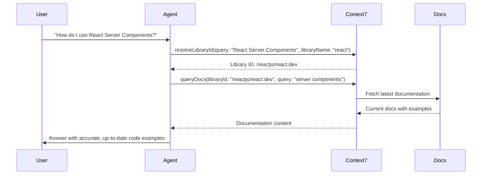

# Agentic Tools

Context7 provides tools and integrations that give your AI agents access to accurate, up-to-date library documentation. Instead of relying on potentially outdated training data, your agents can fetch real-time documentation to answer questions and generate code.

## Why Agentic Tools?

AI agents often struggle with:

- **Outdated knowledge** - Training data becomes stale, leading to deprecated API usage
- **Hallucinated APIs** - Models confidently suggest methods that don't exist
- **Version mismatches** - Code examples from old versions that no longer work

Context7's agentic tools solve these problems by giving your agents direct access to current documentation during inference.

## Available Integrations

<CardGroup cols={1}>
  <Card
    title="Vercel AI SDK"
    icon="wand-magic-sparkles"
    href="/agentic-tools/ai-sdk/getting-started"
  >
    Add Context7 tools to your AI SDK workflows with `generateText`, `streamText`, or use the
    pre-built `Context7Agent` for automatic documentation lookup.
  </Card>
</CardGroup>

## How It Works



## Use Cases

<AccordionGroup>
  <Accordion title="Documentation-Aware Chatbots" icon="comments">
    Build chatbots that answer framework questions with accurate, version-specific information:

    ```typescript
    import { generateText, stepCountIs } from "ai";
    import { openai } from "@ai-sdk/openai";
    import { resolveLibraryId, queryDocs } from "@upstash/context7-tools-ai-sdk";

    const { text } = await generateText({
      model: openai("gpt-5.2"),
      prompt: "How do I set up authentication in Next.js 15?",
      tools: {
        resolveLibraryId: resolveLibraryId(),
        queryDocs: queryDocs(),
      },
      stopWhen: stepCountIs(5),
    });
    ```

  </Accordion>

  <Accordion title="Code Generation Pipelines" icon="code">
    Ensure generated code uses current APIs and best practices:

    ```typescript
    import { Context7Agent } from "@upstash/context7-tools-ai-sdk";
    import { anthropic } from "@ai-sdk/anthropic";

    const agent = new Context7Agent({
      model: anthropic("claude-sonnet-4-20250514"),
    });

    const { text } = await agent.generate({
      prompt: "Generate a Supabase Edge Function that handles webhooks",
    });
    ```

  </Accordion>

  <Accordion title="Code Review Agents" icon="magnifying-glass-chart">
    Build code review agents that verify implementations against current API documentation:

    ```typescript
    import { generateText, stepCountIs } from "ai";
    import { anthropic } from "@ai-sdk/anthropic";
    import { resolveLibraryId, queryDocs } from "@upstash/context7-tools-ai-sdk";

    const codeToReview = `
      const { data } = await supabase
        .from('users')
        .select('*')
        .eq('id', userId)
        .single();
    `;

    const { text } = await generateText({
      model: anthropic("claude-sonnet-4-20250514"),
      prompt: `Review this Supabase code for correctness and best practices:

    ${codeToReview}

    Check against the latest Supabase documentation.`,
      tools: {
        resolveLibraryId: resolveLibraryId(),
        queryDocs: queryDocs(),
      },
      stopWhen: stepCountIs(5),
    });

    // Agent fetches current Supabase docs to verify:
    // - Correct method signatures
    // - Deprecated patterns
    // - Security best practices
    // - Error handling recommendations
    ```

  </Accordion>
</AccordionGroup>
