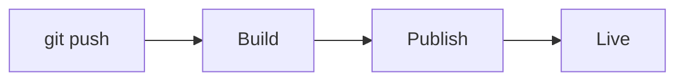

Code blocks are highlighted with Shiki in both light and dark themes. Set the theme pair with `styling.codeblocks` in `docs.json` (defaults: `min-light` / `one-dark-pro`). Every block gets a copy button. Unknown languages fall back to plain text.

## Fence options

Options go on the opening fence line, in any order:

````mdx
```typescript app/deploy.ts icon="rocket" {2} lines wrap
const site = await docs7.deploy({
  repo: "upstash/docs",
});
```
````

| Option | Effect |
|---|---|
| `title="…"` or a bare word | Block title / filename in the header. |
| `icon="…"` | Icon in the header. |
| `{1,3-5}` or `highlight={1,3-5}` | Highlight lines. |
| `focus={2-4}` | Focus lines, dimming the rest. |
| `lines` | Show line numbers. |
| `wrap` | Soft-wrap long lines. |
| `expandable` | Collapse long blocks behind an expander. |

## Diffs

Mark added and removed lines inside the code itself:

````mdx
```typescript example.ts
  const limit = 25;
  throw new Error("file too large"); // [!code --]
  skipped.push(file); // [!code ++]
```
````

`// [!code ++]` and `// [!code --]` mark the line they're on (append `:3` to span three lines). The markers are stripped from the output.

## Code groups

Combine alternatives into one tabbed block:

````mdx
<CodeGroup>

```bash npm
npm install @upstash/docs7
```

```bash pnpm
pnpm add @upstash/docs7
```

</CodeGroup>
````

## Mermaid diagrams

A `mermaid` fence renders as a diagram:

````mdx

````

The Mermaid runtime is only included on sites that use it.

## Math

Write inline math as `$E = mc^2$` and block math with `$$ … $$`. Rendering is auto-detected per page. Force it on or off site-wide with `styling.latex` in `docs.json`. KaTeX assets are only included on sites that use math.
