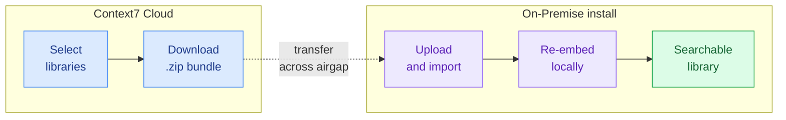

Airgapped on-premise installs can't reach Context7 Cloud, but you may still want the content of public libraries that the cloud already indexes. Library Import lets you select those libraries in the cloud dashboard, download them as a single file, and import that file into your on-premise install.

This feature is available only to customers with an **offline (airgapped) license**. Installs running an online license fetch public library content from the cloud directly and don't need it.

## How It Works

The export bundle carries only snippet content, not embeddings. Embeddings are tied to a specific embedding model, so they aren't portable between deployments. When you import, your on-premise install re-embeds the snippets with its own configured embedding provider. This means imported libraries match the rest of your index and stay fully searchable, with nothing but text crossing the airgap.

## Before You Start

- An **offline on-premise license**. The export page is only visible to accounts that hold one.
- Your on-premise **AI provider is configured** (Settings → completed setup wizard). Import re-embeds snippets, so it needs a working embedding provider.

## Exporting from Context7 Cloud

<Steps>

<Step title="Open the export page">

In the [Context7 Cloud dashboard](https://context7.com), open **More → Export Libraries**. The link only appears for accounts with an offline license.

<Frame>
  
</Frame>

</Step>

<Step title="Select libraries">

Search for libraries by name and click **Add** to put them in your selection. The selection persists while you keep searching, so you can collect libraries from several searches before downloading. Remove a library from the selection with the **x** on its chip.

You can export up to 50 libraries at once.

<Frame>
  
</Frame>

</Step>

<Step title="Download the bundle">

Click **Download selected**. Context7 gathers every code and info snippet for the chosen libraries and produces a single `context7-libraries.zip` file.

</Step>

</Steps>

## Importing on Your On-Premise Install

<Steps>

<Step title="Transfer the file">

Move `context7-libraries.zip` into your airgapped environment using whatever method your security policy allows.

</Step>

<Step title="Open the import page">

In your on-premise dashboard, click **Add Repo**, then choose the **Context7 Export** source. This source only appears on offline-license installs.

<Frame>
  
</Frame>

</Step>

<Step title="Upload and import">

Select your `.zip` export (up to 100 MB). To replace libraries that already exist on this install, enable **Overwrite existing libraries**. Click **Import**.

<Frame>
  
</Frame>

Each library is queued as its own job. Follow progress under the **Parse Queue** tab while snippets are re-embedded locally.

</Step>

</Steps>

## After Import

Imported libraries appear in your Repositories list with an **Imported** badge and are queryable like any other library.

<Frame>
  
</Frame>

Because your install didn't parse these libraries from source, it can't refresh them. The Refresh action is disabled for imported libraries. To update one, export a fresh bundle from Context7 Cloud and import it again with **Overwrite existing libraries** enabled.

<Note>
Re-importing a library you already have does nothing unless **Overwrite existing libraries** is checked. The import skips libraries that already exist and tells you which ones it skipped.
</Note>

## Limits

- Up to 50 libraries per export.
- Export files up to 100 MB per import.
- Only public libraries indexed by Context7 Cloud can be exported.
