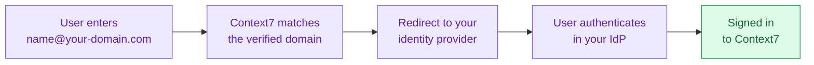

SAML Single Sign-On lets everyone on your teamspace sign in to Context7 with their corporate account instead of a Context7 password. Once it is active, anyone signing in with an email address on your verified domain is sent to your identity provider, authenticates there, and returns to Context7 already signed in.

You configure the connection yourself from the dashboard. Context7 does not need to broker the setup or handle your certificates.

## How It Works

Context7 acts as the SAML **service provider**. Your identity provider issues a signed assertion containing the user's email address, and Context7 accepts it only when that email's domain matches a domain you have proven you own.

## Before You Start

You'll need:

- An **enterprise teamspace**. SSO is not available on personal projects, and the teamspace owner must be on an enterprise plan or an active enterprise trial.
- The **owner or admin** role on that teamspace. Developers can't configure SSO.
- Access to **DNS** for the domain your team signs in with, so you can publish a verification record.
- A **SAML 2.0 identity provider**. Okta, Microsoft Entra ID, Google Workspace, and any custom SAML provider all work.

<Note>
SSO must be switched on for your teamspace before the setup UI appears. If you don't see a **Security** tab in the steps below, contact Context7 support and we'll enable it.
</Note>

## Setting Up SSO

<Steps>

<Step title="Open the SAML SSO settings">

In the [Context7 dashboard](https://context7.com/dashboard), select your teamspace, open the **Enterprise** tab, and choose **SAML SSO**. Then open **Security** in the sidebar.

<Frame>
  
</Frame>

</Step>

<Step title="Add and verify your domain">

Enter the email domain your team signs in with, for example `acme.com`, and click **Add**.

Context7 shows a DNS `TXT` record. Publish it with your DNS provider, and verification completes automatically once the record is live. Propagation is usually quick but can take up to an hour depending on your provider.

<Frame>
  
</Frame>

Verifying the domain is what proves it belongs to you. Only assertions for email addresses on a verified domain are accepted, so no other organization can claim your users.

</Step>

<Step title="Create a SAML application in your identity provider">

Pick your provider, then create a new SAML 2.0 application in its admin console using the two service provider values Context7 shows you:

- **Assertion consumer service (ACS) URL** — where your IdP posts the assertion.
- **Entity ID** — how your IdP identifies Context7.

<Frame>
  
</Frame>

Nothing to fill in on this screen. Copy both values across, then continue.

</Step>

<Step title="Give Context7 your identity provider details">

Now supply the other direction. Two options:

- **Add via metadata** — paste your provider's metadata URL. Context7 fetches the sign-on URL, entity ID, and signing certificate in one go. This is the simpler path when the URL is publicly reachable.
- **Configure manually** — enter the SSO URL and paste the X.509 signing certificate yourself. Use this when your metadata endpoint isn't reachable from the internet.

Make sure the assertion carries the user's **email address**. Context7 matches on it.

</Step>

<Step title="Test the connection">

Click **Open test URL** and sign in as a real user from your directory whose email is on the verified domain. The result appears in the log below.

<Frame>
  
</Frame>

A **Success** row means the whole round trip works: the request reached your IdP, the assertion came back, its signature validated, and the email matched your domain.

</Step>

<Step title="Activate">

Activate the connection to turn it on for your team. The Security page now shows **SSO Active** along with the domains it covers.

<Frame>
  
</Frame>

</Step>

</Steps>

## How Your Team Signs In

Users go to the normal Context7 sign-in page and enter their work email. Context7 recognises the domain and forwards them to your identity provider. They never set or use a Context7 password.

<Note>
SSO controls **authentication**, not teamspace membership. Signing in through your IdP does not by itself add someone to your teamspace. Invite members from the **Members** tab as usual.
</Note>

## Managing the Connection

The **⋯** menu on the SSO row offers:

- **Edit** — revisit any step, including adding more domains.
- **Deactivate** — stop routing users to your IdP without deleting the configuration.
- **Remove** — delete the connection entirely and release its domains.

## Troubleshooting

**"Domain Mismatch" after signing in at your IdP**

The email address in the assertion isn't on a verified domain. This is the expected behaviour when, for example, a test provider issues `user@example.com` while your connection covers `acme.com`. Sign in as a user whose email is on the verified domain, or add and verify the other domain.

**"We failed to fetch the IdP metadata"**

Context7 fetches this URL from its servers, so it must be publicly reachable. Check that you pasted the **metadata** endpoint rather than the sign-on endpoint. They are different URLs, and the sign-on endpoint returns an error for a plain request. If the endpoint is internal, use **Configure manually** instead.

**The Security tab isn't there**

Either SSO hasn't been enabled for your teamspace yet, or you're signed in as a developer. Confirm your role, then contact support.
